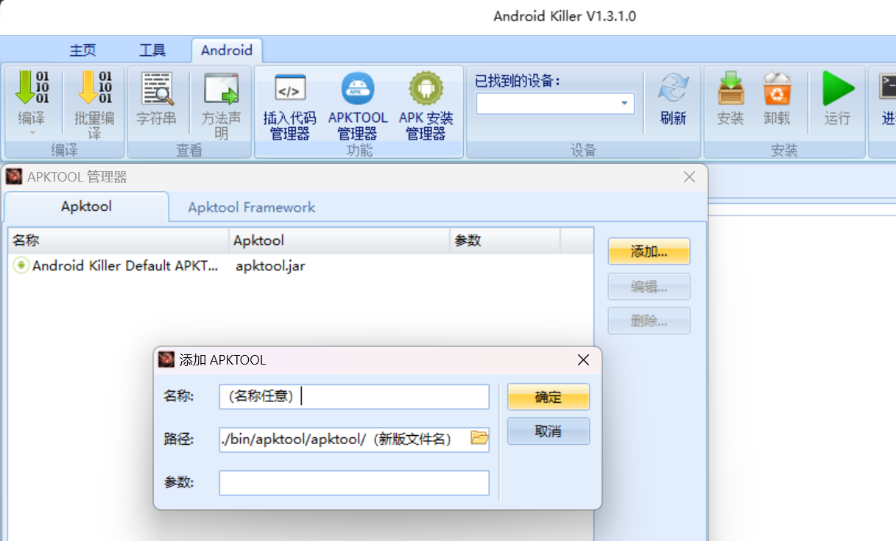
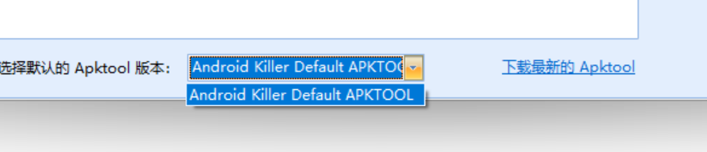

# Android Killer

仅仅只是整合修改了 Android killer 工具，让它再战 20 年！

思路和方法来自大佬 [昨夜星辰 2012](https://www.52pojie.cn/home.php?mod=space&uid=571540&do=profile&from=space) 的 [AndroidKiller 安装、设置及使用教程](https://www.52pojie.cn/thread-726176-1-1.html)。

## 整合修改内容

- `bin/`
  - 更新 `adb` 和 `busybox`，版本未知
  - 更新默认的 `apktool.jar` 至 v2.9.0
  - 更新 `dex2jar` 至 v2.4
  - 弃用内置的 `jd-gui.exe`，使用自己编写的空壳应用 [`android-killer-support-jadx-gui`](https://github.com/SeagullOddy/android-killer-support-jadx-gui) 替换，实现改用 `jadx-gui.exe` 进行默认的反编译操作
- `tools/`
  - 添加 `ApkScan PKID`，来源于 [APK 查壳工具 PKID](http://www.legendsec.org/1888.html)，由于工具年代久远，效果无法保证，建议自行寻找替代方案
  - 添加 `InjectLog`，来源于 [InjectLog 工具使用方法详解](https://www.52pojie.cn/thread-743758-1-1.html) 与 [Android 应用逆向——分析反编译代码之大神器](https://blog.csdn.net/charlessimonyi/article/details/52027563)
  - 添加 `JadxGui`，no-jre 版本，更新至 v1.4.7，**注意：使用 no-jre 版本的 jadx-gui 要求电脑上已经配置好 Java 环境！！**

## 食用方法

[参考此文](https://blog.csdn.net/yiran1919/article/details/132760445) 或自行搜索。

## 更新方法

### Apktool 更新方法
1. 从 [Apktool 下载页面](https://github.com/iBotPeaches/Apktool/releases) 下载最新版的 `apktool_x.x.x.jar`
2. 方法 1：重命名为 `apktool.jar`，覆盖 `bin/apktool/apktool/` 目录下的旧版即可
3. 方法 2：放置在 `bin/apktool/apktool/` 目录下，打开 `Android Killer` 首页的 `Android` 标签并打开 `APKTOOL 管理器`，添加新版并选择为默认
   
   

### dex2jar 更新方法
1. 从 [dex2jar 下载页面](https://github.com/pxb1988/dex2jar/releases) 下载最新版的 `dex-tools-xxx.zip`（旧版名为 `dex2jar-xxx.zip`）
2. 清空 `bin/dex2jar/` 目录下文件，将下载得到的压缩包内容全部解压缩至该目录即可

### jadx-gui 更新方法
1. 从 [jadx-gui 下载界面](https://github.com/skylot/jadx/releases) 下载最新版的 `jadx-gui-x.x.x-no-jre-win.exe`
2. 重命名为 `jadx-gui.exe`，放在 `tools/JadxGui/` 目录下覆盖旧版即可

## 注意事项 & 一些问题

- 编译应用时请勾选 AndroidKiller 签名，否则可能导致编译出的 apk 文件不正常
- 编译后安装报错：`Failure [INSTALL_FAILED_INVALID_APK: Failed to extract native libraries, res=-2]`，请将 `AndroidManifest.xml` 文件中的 `extractNativeLibs=false` 修改为 `extractNativeLibs=true`，并尝试再次编译安装
